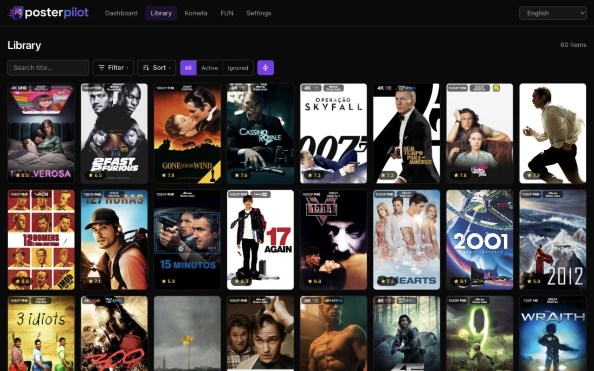
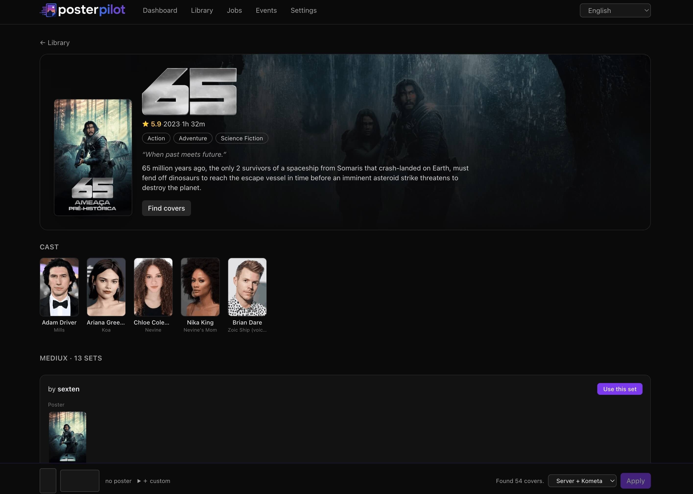

<div align="center">

<picture>
  <source media="(prefers-color-scheme: dark)" srcset="artwork/texticon-posterpilot.png" />
  
</picture>

### Self-hosted artwork manager for Plex, Jellyfin &amp; Emby

Find covers across **MediUX**, **Fanart.tv**, **TMDB** &amp; **ThePosterDB** and apply them
to your media server or via Kometa/PMM — in a single Docker container.

[](https://github.com/diegopeixoto/posterpilot/actions/workflows/ci.yml)
[](https://github.com/diegopeixoto/posterpilot/releases)
[](LICENSE)
[](https://github.com/diegopeixoto/posterpilot/pkgs/container/posterpilot)
[](https://diegopeixoto.github.io/posterpilot)
[](https://hosted.weblate.org/engage/posterpilot/)

<br />

**Media servers**

[](https://www.plex.tv)
[](https://jellyfin.org)
[](https://emby.media)

**Artwork providers**

[](https://mediux.pro)
[](https://fanart.tv)
[](https://www.themoviedb.org)
[](https://theposterdb.com)

🌐 Multi-language &nbsp;·&nbsp; 🖥️ Direct API &nbsp;·&nbsp; 📄 Kometa / PMM YAML &nbsp;·&nbsp; 🐳 Docker

</div>

> Spec-driven via [OpenSpec](https://github.com/Fission-AI/OpenSpec). See
> `openspec/specs/` for the capability specs and `openspec/changes/` for in-flight
> proposals.

📖 **Documentation:** full installation, configuration, usage, contributing, and
translating guides live at
**[diegopeixoto.github.io/posterpilot](https://diegopeixoto.github.io/posterpilot)**.

## Screenshots

<p align="center">
  
  
</p>

## What it does

1. **Sync** your Plex / Jellyfin / Emby movie & show libraries, resolving each
   title to a TMDB id with rich metadata (backdrop, logo, rating, genres, cast).
2. **Find covers** across the enabled providers (MediUX, Fanart.tv, TMDB,
   ThePosterDB), grouped into artwork **sets** per provider — pick a whole set or
   assemble a custom poster + backdrop set from any provider, a pasted URL, or an
   uploaded file.
3. **Apply** a chosen cover, two ways (selectable):
   - **Media server API** — uploads the poster (and backdrop) and, on Plex, locks
     the field so agents won't overwrite it.
   - **Kometa export** — writes `url_poster`/`url_background` YAML into a mounted
     directory your existing Kometa instance consumes on its next run.

A guided **first-install wizard** (language → server → TMDB → providers →
libraries → first sync) gets you running fast; for Plex it includes **PIN login**
and **connection discovery** so you never have to hunt down a token or URL. A
metadata-rich item page (backdrop hero, cast, artwork grouped into sets), a
Notion-style filtered/sorted library wall, an in-app **Activity** log, and a UI
localized into five languages round it out. Library-wide work runs as background
jobs with live progress (SSE) right on the Dashboard, and an update checker plus
**What's New** modal surface new releases.

## Stack

- **SvelteKit** (TypeScript) on **Bun**, built with `adapter-node` (run under Bun)
- **SQLite + Drizzle ORM** (libsql) — library cache, candidates, history, jobs, settings
- **Tailwind CSS v4**, dark image-forward UI
- In-process job queue + **Server-Sent Events** for live progress

## Develop

```sh
bun install
cp .env.example .env          # fill PLEX_URL / PLEX_TOKEN / TMDB_KEY (or use the Settings UI)
bun run db:generate           # generate SQL migrations from the Drizzle schema (already committed)
bun run dev                   # http://localhost:5173
```

Migrations are applied automatically on server startup. Useful scripts:

| script                    | purpose                                |
| ------------------------- | -------------------------------------- |
| `bun run dev`             | dev server                             |
| `bun run build`           | production build (adapter-node)        |
| `bun run start`           | run the built server (`node build`)    |
| `bun run check`           | svelte-check type checking             |
| `bun run test`            | vitest unit tests                      |
| `bun run format` / `lint` | prettier write / check                 |
| `bun run fallow`          | Fallow code-intelligence health report |

## Run with Docker (Mac and Unraid)

The same image runs anywhere. Use the **official multi-arch image** (amd64 + arm64)
from GitHub Container Registry:

```sh
docker pull ghcr.io/diegopeixoto/posterpilot:latest
```

Then point `docker-compose.yml` at `image: ghcr.io/diegopeixoto/posterpilot:latest`
(instead of `build: .`) and start it:

```sh
docker compose up -d
# UI at http://localhost:3000
```

Or build locally instead:

```sh
docker compose up -d --build
```

Configuration is via environment variables (or the in-app **Settings** page).
Core variables — see the [Configuration docs](https://diegopeixoto.github.io/posterpilot/configuration/)
for the complete reference:

| var                                                      | meaning                                                          |
| -------------------------------------------------------- | ---------------------------------------------------------------- |
| `SERVER_TYPE`                                            | active media server: `plex` (default), `jellyfin`, or `emby`     |
| `PLEX_URL` / `PLEX_TOKEN`                                | Plex base URL and `X-Plex-Token` (or acquire via in-app login)   |
| `PLEX_CLIENT_ID`                                         | stable per-install id for Plex PIN login / discovery (generated) |
| `JELLYFIN_URL` / `JELLYFIN_API_KEY`                      | Jellyfin server URL and API key                                  |
| `EMBY_URL` / `EMBY_API_KEY`                              | Emby server URL and API key                                      |
| `TMDB_KEY`                                               | TMDB v3 API key **or** v4 bearer/JWT (auto-detected)             |
| `FANART_KEY`                                             | Fanart.tv API key (enables the Fanart.tv provider)               |
| `PROVIDER_MEDIUX` / `_TMDB` / `_FANART` / `_THEPOSTERDB` | per-provider on/off toggles                                      |
| `DEFAULT_APPLY_METHOD`                                   | default apply method: `plex`, `kometa`, or `both` (default)      |
| `INCLUDED_SECTIONS`                                      | library section keys to sync (empty = all movie/show libraries)  |
| `APP_LANGUAGE`                                           | UI locale: `en` (default), `es`, `zh`, `ja`, `pt-BR`             |
| `KOMETA_ASSETS_DIR`                                      | where exported Kometa YAML is written (default `/kometa`)        |
| `LOG_DIR`                                                | rotating log file folder (default `/data/logs` in Docker)        |
| `EVENT_RETENTION`                                        | max activity-log rows kept in the db (default `2000`)            |
| `DATABASE_URL`                                           | libsql file URL (default `file:/data/posterpilot.db` in Docker)  |
| `PORT`                                                   | listen port (default `3000`)                                     |

Two volumes matter:

- **`/data`** — persistent SQLite db, settings, and history. Keep this on a
  mounted volume so state survives container updates. The rotating log file
  (`posterpilot.log`, ~5 MB × 5 files) lives at `/data/logs`, so this one volume
  covers it too — no extra log mount is needed.
- **`/kometa`** — mount your Kometa assets/config directory here so the exported
  YAML lands where Kometa reads it.

### Unraid

A Community Apps template is included at
[`unraid/posterpilot.xml`](unraid/posterpilot.xml). On Unraid: **Docker → Add
Container**, paste the template URL into _Template_:

```
https://raw.githubusercontent.com/diegopeixoto/posterpilot/main/unraid/posterpilot.xml
```

It pre-fills the GHCR image, the WebUI port, the `/data` and `/kometa` volumes,
and the credential fields (all optional — you can configure them in the in-app
Settings page instead, including Plex login).

Point the Kometa volume at your existing Kometa config, e.g. in
`docker-compose.yml`:

```yaml
volumes:
  - /mnt/user/appdata/posterpilot:/data
  - /mnt/user/appdata/kometa/config:/kometa
```

Set your media-server and `TMDB_KEY` credentials in the container's environment
(or leave them blank and configure via the Settings page — including Plex login),
then browse to the container on port 3000.

## How Kometa consumes the export

posterpilot writes a single metadata file (default `posterpilot.yml`) into
`KOMETA_ASSETS_DIR`, keyed by TMDB id with `url_poster` / `url_background`
entries — the same shape the legacy scraper produced. Add that file to your
Kometa library config (e.g. under `metadata_path`/`metadata_files`) so Kometa
applies the covers on its next run. Re-applying updates entries in place.

## Health check

The app exposes an unauthenticated `GET /api/health` that returns
`{ "status": "ok", "version": "x.y.z" }` with HTTP 200 — use it as a container
health probe (the bundled `docker-compose.yml` already does):

```sh
curl -s http://localhost:3000/api/health
```

## Translating

The UI is localized into English (default), Spanish, Simplified Chinese,
Japanese, and Brazilian Portuguese, with per-key English fallback so an
untranslated string always shows readable English, never a raw key. The active
language is resolved per request from your persisted preference (set via the
header switcher or Settings), then your browser's `Accept-Language`, then
English.

[](https://hosted.weblate.org/engage/posterpilot/)

Translations live as one JSON catalog per locale under `messages/` (e.g.
`messages/es.json`), with `messages/en.json` as the complete source. They are
managed through [Weblate](https://hosted.weblate.org/engage/posterpilot/) — join
the project to translate in your browser; completed strings land back in the repo
via git. New English strings added to `en.json` automatically appear as
untranslated entries for every language. You can also edit a catalog directly and
open a PR. See [CONTRIBUTING.md](CONTRIBUTING.md#translators) for the full
workflow.

## Contributing

Issues and PRs welcome — see [CONTRIBUTING.md](CONTRIBUTING.md) for setup, the
quality gates, and the Conventional Commits convention. Translations are managed
through Weblate; you can also edit `messages/<locale>.json` and open a PR. Please
follow the [Code of Conduct](CODE_OF_CONDUCT.md). Report security issues per the
[Security Policy](SECURITY.md).

## Reference

Scraping behavior is ported from the legacy Python tool `mediux-scraper-monorepo`
(reference only — no Python code is reused).

## Disclaimer

PosterPilot is an independent, community-built project. It is **not affiliated
with, endorsed by, or sponsored by** Plex, Jellyfin, Emby, MediUX, Fanart.tv,
TMDB, ThePosterDB, Kometa, or any other third-party service it integrates with.
All product names, logos, and trademarks are the property of their respective
owners and are used here for identification purposes only.

This product uses the TMDB API but is not endorsed or certified by
[TMDB](https://www.themoviedb.org).

## License

Released under the [MIT License](LICENSE).

---

Copyright (c) 2026 Diego Peixoto — MIT licensed.
